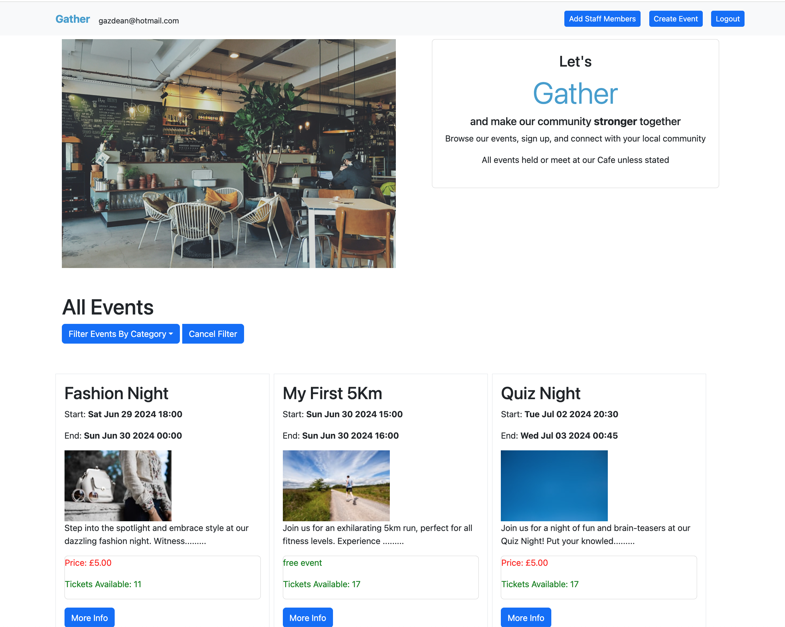
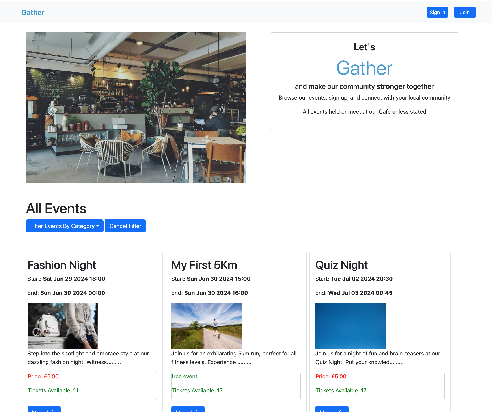
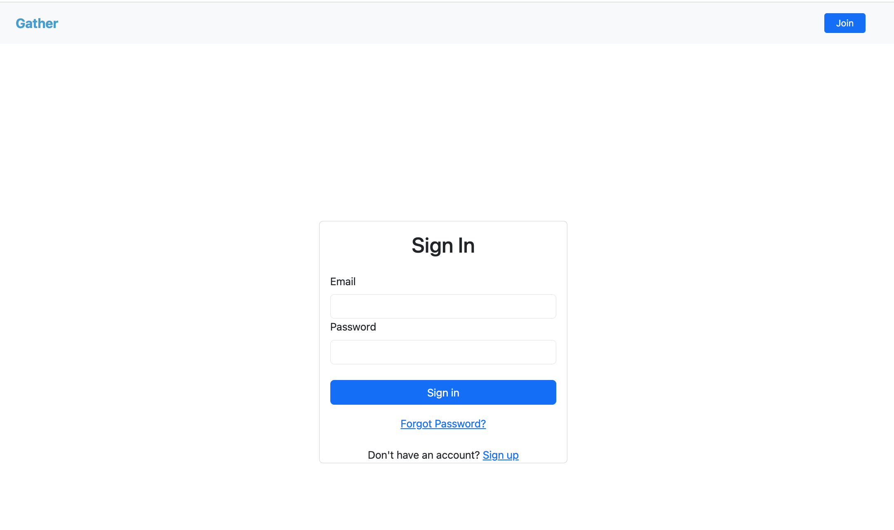
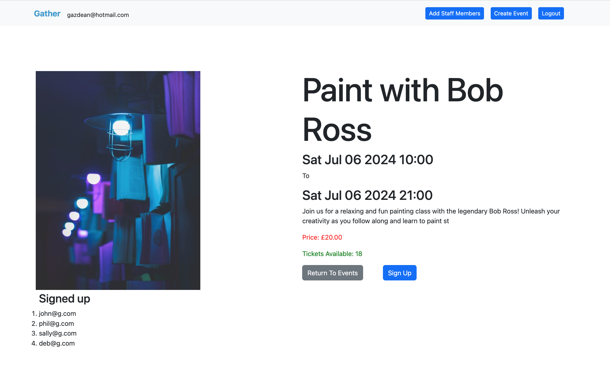
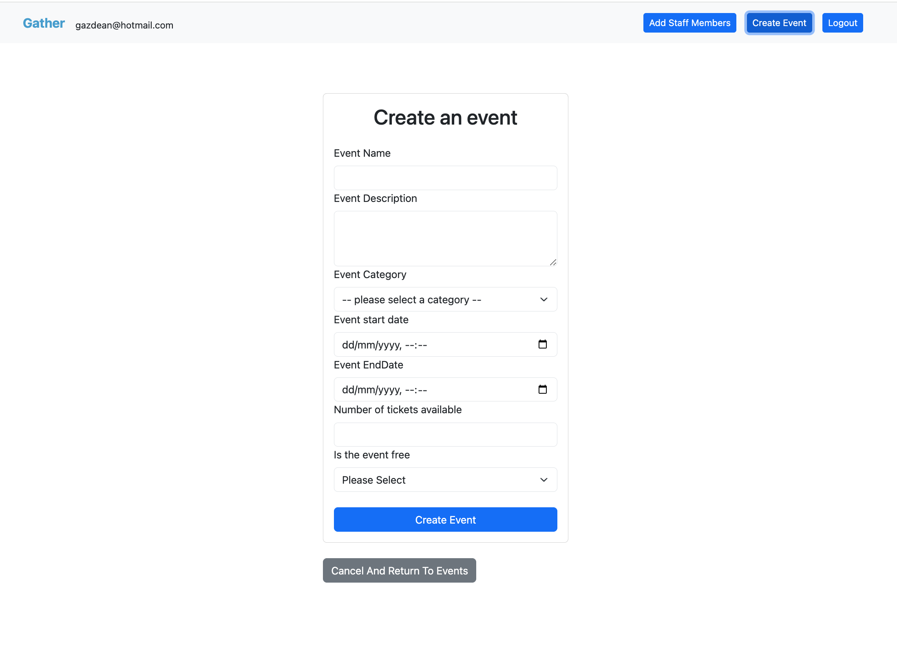
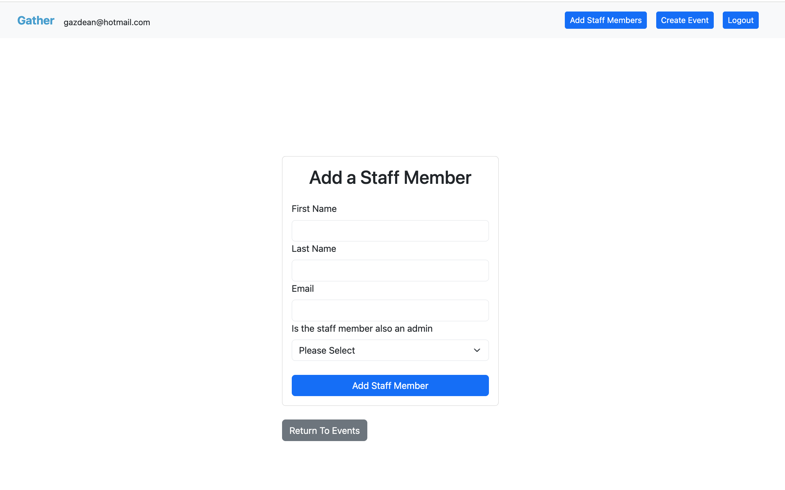
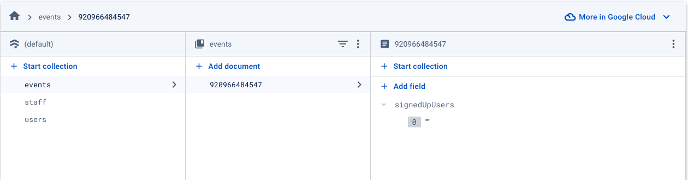
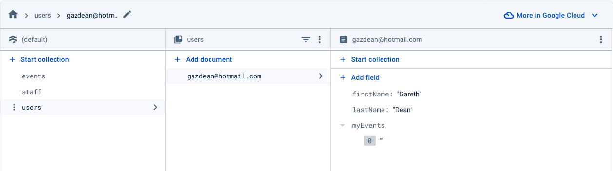
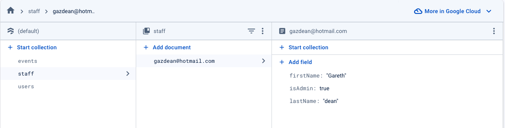

# **[Gather Events]()**

Gather Events is a event platform for a small business, it displays events created by the business.\
It is hosted [here]()



## User Stories

- It allows all users to view events
- It allows events to be filtered by category
- it allows a user to sign up, sign in and also reset password
- It allows signed in users to sign up for events
- It allows signed in staff members to create events
- It allows signed in admins to add staff to the database







## Tech Stack

- [React](https://react.dev/) - For app creation from components
- JavaScript 
- [Vite](https://vitejs.dev/) - For app set up
- [Firebase](https://firebase.google.com/) -  For both Authorisation and Cloud FireStore DataBase
- [Google Cloud](https://console.cloud.google.com/) - [Google Calendar Api](https://console.cloud.google.com/apis/library/calendar-json.googleapis.com)
- [Unsplash Api](https://unsplash.com/developers) - To fetch a collection of images in to the app
- [Eventbrite(https://www.eventbrite.co.uk/)] - To create, store and fetch events
- [Axios](https://axios-http.com/docs/intro) - For Api calls
- [React-Hook-Form](https://react-hook-form.com) - For dealing with form validation
- [React-Bootstrap](https://react-bootstrap.netlify.app/) - For styling and reday made components
- [Netlify](https://www.netlify.com/) - For Hosting
- [Jest](https://jestjs.io/) - Testing

## Running Locally
To run the app locally you will need to create a new folder and [intialiseit with git](https://kbroman.org/github_tutorial/pages/init.html) (git init) then [clone the repository](https://docs.github.com/en/repositories/creating-and-managing-repositories/cloning-a-repository) and save it locally to the folder.

Open the repository in your choosen code editor, open a new terminal and navigate to the new folder, run

```
~ npm install
```

this will install all the dependencies for the app to run

Create a .env.local file in the application's root directory to store your api keys, and other sensitive data

![VITE_APP_FIREBASE_API_KEY=Your-Key-Here
VITE_APP_FIREBASE_AUTH_DOMAIN=Your-Key-Here
VITE_APP_FIREBASE_PROJECT_ID=Your-Key-Here
VITE_APP_FIREBASE_STORAGE_BUCKET=Your-Key-Here
VITE_APP_FIREBASE_MESSAGING_SENDER_ID=Your-Key-Here
VITE_APP_FIREBASE_APP_ID=Your-Key-Here
VITE_EVENTBRITE_PERSONAL_OAUTH_TOKEN=Your-Key-Here
VITE_EVENTBRITE_ORGANIZATION_ID=Your-Key-Here
VITE_EVENTBRITE_ORGANIZER_ID=Your-Key-Here
VITE_UNSPLASH_API_KEY=Your-Key-Here
VITE_UNSPLASH_SECRET_KEY=Your-Key-Here
VITE_GOOGLE_API_KEY=Your-Key-Here
VITE_GOOGLE_CLIENT_ID=Your-Key-Here](./readme-images/envFile.png)

## Create accounts

You will need to create to the following acconts and store the associated api keys in the .env.local file next to the associated keys

### Google 
Sign into your [google account](https://console.cloud.google.com/) and follow the instructions to create a new app, and enable the [google calendar api](https://console.cloud.google.com/apis/library/calendar)
create the api keys and add to the .env file

### Unsplash
[Create an account](https://unsplash.com/login) and [create an app](https://unsplash.com/oauth/applications) this will generate the necessary api keys and add to the .env file

### Eventbrite
[Create an account](https://id.auth.eventbrite.com/u/login) and go to account settings/developer links to create your api keys and add to the .env file

### FireBase

- Sign in and go to your console
- Now create a new project

#### Authentication
Once the project has been created 
- go to the left hand menu go to build and authentication, and then click get started.
- Select the email signin method and enable
- Now click on project overview at the top of the menu and add a web app to create the required api keys and add to the .env file

#### FireStore Database
- go to the left hand menu go to build and authentication, and then click get started.
- click create database
- and follow the instructions, select region and create in production mode

Your database will need the following 3 collections

events
- collection : "events"
- document : "an event id"
- field : signedUpUsers set as an array



- 
users
- collection : "events"
- document : "an event id"
- field : signedUpUsers set as an array



staff
- collection : "events"
- document : "an event id"
- field : signedUpUsers set as an array



## Run on local host

in your terminal run 

```
~ npm run dev
```

and click on the link


